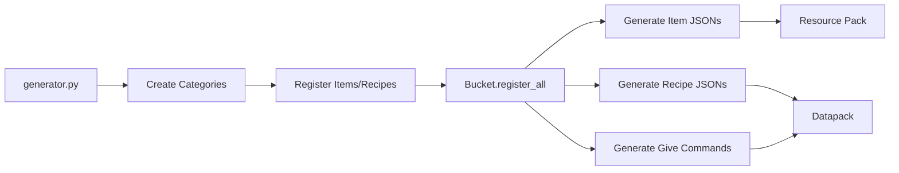

[](https://ko-fi.com/Y8Y7DH7YN)

Tasty Supplies is a datapack that add a lot of new foods, recipes and even cooking mechanics in Minecraft by remaining Vanilla.
You'll be able to prepare a wide variety of delicious dishes from cookies to salad and pies.

*For now, the datapack is in early development and there are still many features and recipes to be added. To keep track of what's new and to keep an eye on the progress of the project, you can star the project on [GitHub]([https://github.com/atomic-junky/tasty-supplies](https://github.com/atomic-junky/tasty-supplies)).*

## Features

For now, Tasty Supplies add **+80 recipes**, **2 sets of tools** and **1 workstation**.<br>
To know more about it, we invite you to read the [documentation](https://atomic-junky.github.io/tasty-supplies/#/).

<p align="center">
  
</p>

*Some of these textures come from the [Farmer's Delight](https://modrinth.com/mod/farmers-delight) mod*

## Contribute

First, please vote for this [sugestion](https://feedback.minecraft.net/hc/en-us/community/posts/24834246348173-Add-the-new-components-to-crafting-recipe-inputs-Datapacks)! If Mojang add data-driven items, it'll add a bunch of new posibilities for this datapack and many other!

To contribute you'll need to use [beet](https://github.com/mcbeet/beet/tree/728859b2bf7b7725fcf7aa7de3788c668ffd668d).

First link beet to your dev world

```cmd
C:\> beet link <dev_world_name>
```

And second make beet watch all changes

```cmd
C:\> beet watch
```

Replace `beet` with `beet -p ./tasty_supplies/` if you want to stay in the root folder, else do `cd ./tasty_supplies/`.

Like that if you make any changes for the data pack just type `/reload` in minecraft and if you make in any chnages for the resource pack, disable and re-enable the resource pack.

## How it works

This project uses [beet](https://github.com/mcbeet/beet) to automatically generate Minecraft datapacks and resource packs. Instead of writing complex JSON files manually, you define items and recipes in Python.

### Architecture

The generator uses a **bucket pattern**:

```
Python Code → Bucket (Registry) → JSON Files (Datapack + Resource Pack)
```

### Core Concepts

#### **Bucket** - Central Registry

The `Bucket` class manages all items and recipes:

```python
bucket = Bucket()

# Add items and recipes with categories
bucket.add_item(butter, category="ingredients")
bucket.add_recipe(butter_recipe, category="cooking")

# Export everything to datapack/resource pack
bucket.register_all(ctx)
```

**Features:**

- Automatic recipe ID generation
- Category organization
- Generates `/give` commands for all items

#### **Items**

Custom items use Minecraft's `custom_model_data` to override vanilla item models:

```python
butter = Item(
    name="butter",
    base_item="poisonous_potato",  # Vanilla item to extend
    display_name="Butter",
    max_stack_size=64,
    food_properties={"nutrition": 3, "saturation": 2.4}
)
```

Place your texture in `src/assets/tasty_supplies/textures/item/butter.png`

#### **Recipes**

Recipes are independent from items and support both vanilla and custom items:

```python
# Shapeless crafting
butter_recipe = ShapelessRecipe(
    ingredients=["milk_bucket"],
    result=butter,
    recipe_id="butter"
)

# Auto-cooking (generates blasting, smoking, and campfire recipes)
cooked_rice = AutoCookingRecipe(
    ingredient="wheat_seeds",
    result=rice_item,
    experience=0.1,
    base_cooking_time=200
)
```

**Available recipe types:**

- `ShapelessRecipe` - Any arrangement in crafting grid
- `ShapedRecipe` - Specific pattern required
- `SmeltingRecipe` - Furnace/blast furnace/smoker/campfire
- `AutoCookingRecipe` - Generates all cooking variants
- `SmithingTransformRecipe` - Smithing table
- `CuttingBoardRecipe` - Custom workstation

### Generation Pipeline



The generator follows these steps:

1. **Define categories** (ingredients, meals, sweets, etc.)
2. **Register items and recipes** to the bucket with categories
3. **Export everything** with `bucket.register_all(ctx)`
4. **Generate files**: Item models, recipe JSONs, and `/give` commands

### Example

```python
# Create a custom fried egg item with cooking recipe
bucket = Bucket()

fried_egg = Item(
    name="fried_egg",
    base_item="poisonous_potato",
    display_name="Fried Egg",
    food_properties={"nutrition": 8, "saturation": 2.4}
)

egg_recipe = AutoCookingRecipe(
    ingredient="egg",
    result=fried_egg,
    experience=0.1,
    base_cooking_time=140
)

bucket.add_item(fried_egg, category="ingredients")
bucket.add_recipe(egg_recipe, category="cooking")
bucket.register_all(ctx)
```

## Credits

Certain items texture/models come from or are base on [Farmer's Delight](https://github.com/vectorwing/FarmersDelight) and [Nether's Delight](https://github.com/Chefs-Delight/NethersDelight_Forge).
