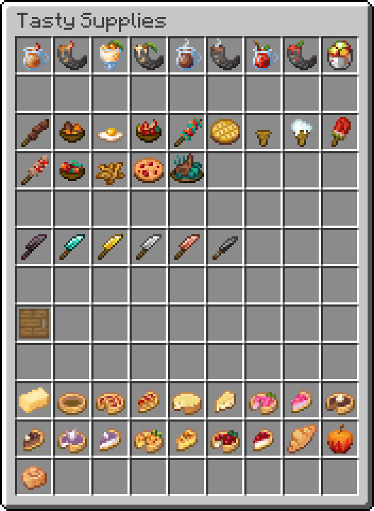

> A [Farmer's Delight](https://modrinth.com/mod/farmers-delight) inspired Datapack for Minecraft 1.21.5+.

Tasty Supplies is a datapack that add a lot of new foods, recipes and even cooking mechanics in Minecraft by remaining Vanilla.
You'll be able to prepare a wide variety of delicious dishes from cookies to salad and pies.

*For now, the datapack is in early development and there are still many features and recipes to be added. To keep track of what's new and to keep an eye on the progress of the project, you can star the project on [GitHub]([https://github.com/atomic-junky/tasty-supplies](https://github.com/atomic-junky/tasty-supplies)).*

## Features

For now, Tasty Supplies add **+40 recipes**, **8 advancements** and **1 workstation**.<br>
To know more about it, we invite you to read the [documentation](https://atomic-junky.github.io/tasty-supplies/#/).

<p align="center">
  
</p>

*Some of these textures come from the [Farmer's Delight](https://modrinth.com/mod/farmers-delight) mod*

## Contribute

First, please vote for this [sugestion](https://feedback.minecraft.net/hc/en-us/community/posts/24834246348173-Add-the-new-components-to-crafting-recipe-inputs-Datapacks)! If Mojang add data-driven items, it'll add a bunch of new posibilities for this datapack and many other!

To contribute you'll need to use [beet](https://github.com/mcbeet/beet/tree/728859b2bf7b7725fcf7aa7de3788c668ffd668d).

First link beet to your dev world

```cmd
C:\> beet link <dev_world_name>
```

And second make beet watch all changes

```cmd
C:\> beet watch
```

Replace `beet` with `beet -p ./tasty_supplies/` if you want to stay in the root folder, else do `cd ./tasty_supplies/`.

Like that if you make any changes for the data pack just type `/reload` in minecraft and if you make in any chnages for the resource pack, disable and re-enable the resource pack.

## How it works (technical documentation)

This project uses [beet](https://github.com/mcbeet/beet) to automatically generate Minecraft datapacks with custom food items. The system provides a simple Python API to create items without dealing with complex JSON structures subject to change in future updates.

### Basic Usage

```py
Item(
    "fried_egg",
    AutoBakeRecipe(
        ingredient="egg",
        experience=0.1,
        cookingtime=140,
        result=FoodResult(nutrition=8, saturation=2.4)
    )
).register(ctx)
```

### Models

#### Item

<details>
<summary>
    <code>Item(name, recipe, base_item)</code>
</summary>

Create a new custom item.

> [!IMPORTANT]  
> You need to put the item texture in `tasty_supplies/src/assets/tasty_supplies/textures/item/` folder with the right item name.

**Parameters:**

- `name` *(str)*: Item identifier
- `recipe` *(Recipe)*: Recipe for crafting/cooking the item
- `base_item` *(str, optional)*: Base Minecraft item. Default: `"bread"`

**Methods:**

- `register(ctx)`: Registers the item and generates all files

**Generates:**

- **[Resource Pack]** `assets/tasty_supplies/models/item/{name}.json`
- **[Resource Pack]** `assets/tasty_supplies/item_models/{name}.json`
- **[Resource Pack]** `assets/minecraft/item_models/{base_item}.json`

**Example:**

```py
Item(
    "cheese",
    recipe=AutoBakeRecipe(...),
    base_item="bread"
).register(ctx)
```

</details>

<details>
<summary>
    <code>BlockItem(name, recipe, base_item)</code>
</summary>

Create a new custom item.

> [!IMPORTANT]  
> You need to put the item texture in `tasty_supplies/src/assets/tasty_supplies/textures/item/` folder with the right item name.

**Parameters:**

- `name` *(str)*: Item identifier
- `recipe` *(Recipe)*: Recipe for crafting/cooking the item
- `base_item` *(str, optional)*: Base Minecraft item. Default: `"bread"`

**Methods:**

- `register(ctx)`: Registers the item and generates all files

**Generates:**

- **[Resource Pack]** `assets/tasty_supplies/models/item/{name}.json`
- **[Resource Pack]** `assets/tasty_supplies/item_models/{name}.json`
- **[Resource Pack]** `assets/minecraft/item_models/{base_item}.json`

**Example:**

```py
Item(
    "cheese",
    recipe=AutoBakeRecipe(...),
    base_item="bread"
).register(ctx)
```

</details>

#### Recipes

<details>
<summary>
    <code>ShapedRecipe(key, pattern, result, category)</code>
</summary>

Crafting table with specific pattern.

**Parameters:**

- `key` *(dict)*: Maps pattern letters to items
- `pattern` *(list[str])*: Crafting pattern
- `result` *(Result)*: Item properties when crafted
- `category` *(str, optional)*: Recipe category. Default: `"misc"`

**Generates:**

- **[Datapack]** `data/tasty_supplies/recipes/{name}.json`

**Example:**

```py
ShapedRecipe(
    key={
        "W": "wheat", 
        "A": "apple", 
        "S": "sugar", 
        "C": "bread"
    },
    pattern=["WWW", "AAA", "SCS"],
    result=FoodResult(nutrition=8, saturation=6)
)
```

</details>

<details>
<summary>
    <code>ShapelessRecipe(ingredients, result, category)</code>
</summary>

Crafting recipe without specific positioning.

**Parameters:**

- `ingredients` *(list[str])*: Required items (supports tags with `#`)
- `result` *(Result)*: Item properties when crafted
- `category` *(str, optional)*: Recipe category. Default: `"misc"`

**Generates:**

- **[Datapack]** `data/tasty_supplies/recipes/{name}.json`

**Example:**

```py
ShapelessRecipe(
    ingredients=["bowl", "apple", "melon_slice", "#tasty_supplies:berries"],
    result=FoodResult(nutrition=18, saturation=7.6)
)
```

</details>

<details>
<summary>
    <code>AutoBakeRecipe(ingredient, experience, cookingtime, result)</code>
</summary>

Auto-generates item recipes for blasting, smoking and campfire. Smoked recipes cook 30% faster, while campfire recipes cook 30% slower.

**Parameters:**

- `ingredient` *(str)*: Item to cook
- `experience` *(float)*: XP reward
- `cookingtime` *(int)*: Cooking time in ticks
- `result` *(Result)*: Item properties when cooked

**Generates:**

- **[Datapack]** `data/tasty_supplies/recipes/{name}_blasting.json`
- **[Datapack]** `data/tasty_supplies/recipes/{name}_smoking.json`
- **[Datapack]** `data/tasty_supplies/recipes/{name}_campfire.json`

**Example:**

```py
AutoBakeRecipe(
    ingredient="milk_bucket",
    experience=0.5,
    cookingtime=200,
    result=FoodResult(nutrition=8, saturation=5.6)
)
```

</details>

<details>
<summary>
    <code>BlastingRecipe(ingredient, experience, cookingtime, result)</code>
</summary>

Blast furnace recipe.

**Parameters:**

- `ingredient` *(str)*: Item to cook
- `experience` *(float)*: XP reward
- `cookingtime` *(int)*: Cooking time in ticks
- `result` *(Result)*: Item properties when cooked

**Generates:**

- **[Datapack]** `data/tasty_supplies/recipes/{name}.json`

</details>

<details>
<summary>
    <code>SmeltingRecipe(ingredient, experience, cookingtime, result)</code>
</summary>

Furnace recipe.

**Parameters:**

- `ingredient` *(str)*: Item to cook
- `experience` *(float)*: XP reward
- `cookingtime` *(int)*: Cooking time in ticks
- `result` *(Result)*: Item properties when cooked

**Generates:**

- **[Datapack]** `data/tasty_supplies/recipes/{name}_smelting.json`

</details>

<details>
<summary>
    <code>SmokingRecipe(ingredient, experience, cookingtime, result)</code>
</summary>

Smoker recipe.

**Parameters:**

- `ingredient` *(str)*: Item to cook
- `experience` *(float)*: XP reward
- `cookingtime` *(int)*: Cooking time in ticks
- `result` *(Result)*: Item properties when cooked

**Generates:**

- **[Datapack]** `data/tasty_supplies/recipes/{name}_smoking.json`

</details>

<details>
<summary>
    <code>CampfireRecipe(ingredient, cookingtime, result)</code>
</summary>

Campfire cooking recipe.

**Parameters:**

- `ingredient` *(str)*: Item to cook
- `cookingtime` *(int)*: Cooking time in ticks
- `result` *(Result)*: Item properties when cooked

**Generates:**

- **[Datapack]** `data/tasty_supplies/recipes/{name}_campfire.json`

</details>

#### Results

<details>
<summary>
    <code>Result(count, max_stack_size, extra_components)</code>
</summary>

Basic item properties with custom components.

**Parameters:**

- `count` *(int, optional)*: Item count. Default: `1`
- `max_stack_size` *(int, optional)*: Stack limit. Default: `64`
- `extra_components` *(dict, optional)*: Additional item components

**Example:**

```py
Result(
    count=1,
    max_stack_size=64,
    extra_components={"max_damage": 100}
)
```

</details>

<details>
<summary>
    <code>FoodResult(nutrition, saturation, effects, ...)</code>
</summary>

Edible item properties with nutrition and effects.

**Parameters:**

- `nutrition` *(int)*: Hunger points restored
- `saturation` *(float)*: Saturation value
- `effects` *(list[Effect], optional)*: Potion effects when eaten
- `can_always_eat` *(bool, optional)*: Edible when full. Default: `False`
- `max_stack_size` *(int, optional)*: Stack limit. Default: `64`
- `extra_components` *(dict, optional)*: Additional item components

**Example:**

```py
FoodResult(
    nutrition=8,
    saturation=6,
    effects=[Effect("speed", 3600, 1)]
)
```

</details>

<details>
<summary>
    <code>PotionResult(potion_effects, max_stack_size, ...)</code>
</summary>

Drinkable item properties with potion effects.

**Parameters:**

- `potion_effects` *(list[Effect])*: Effects when consumed
- `max_stack_size` *(int, optional)*: Stack limit. Default: `1`
- `extra_components` *(dict, optional)*: Additional item components

**Example:**

```py
PotionResult(
    potion_effects=[Effect("regeneration", 600)]
)
```

</details>

<details>
<summary>
    <code>Effect(effect, duration, amplifier)</code>
</summary>

Potion effect definition.

**Parameters:**

- `effect` *(str)*: Effect ID (e.g., `"speed"`, `"regeneration"`)
- `duration` *(int, optional)*: Duration in ticks (20 = 1 second). Default: `0`
- `amplifier` *(int, optional)*: Effect level (0 = I, 1 = II). Default: `0`

**Example:**

```py
Effect("speed", 3600, 1)  # Speed II for 3 minutes
```

</details>

## Credits

Certain items texture/models come from or are base on [Farmer's Delight](https://github.com/vectorwing/FarmersDelight), [Nether's Delight](https://github.com/Chefs-Delight/NethersDelight_Forge) and [FastFood Delight](https://github.com/akaneoMT/FastFoodDelight).
