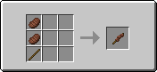
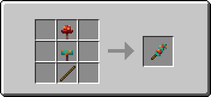
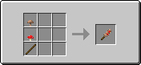
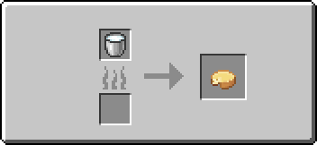
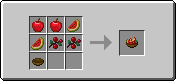
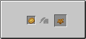
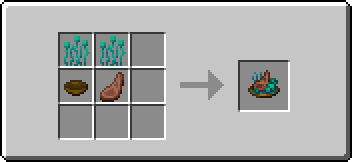
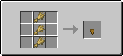
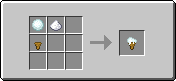
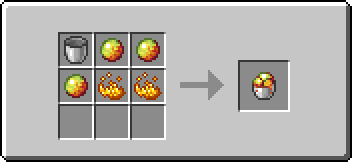

# Crafts

!> Food nutrition and saturation is subject to change.

## Meals

#### Beef Skewer
  
<food hgr="16" sat="25.6" />

#### Fungus Skewer
  
<food hgr="5" sat="6" :efs="['Nausea (0:30)']" />

#### Mushroom Skewer
  
<food hgr="6" sat="7.2" />

#### Cheese
  
<food hgr="8" sat="5.2" />

#### Cheese Slice
  
*This craft is made by using a **[cutting board](workstations#cutting-board)!***  
<food hgr="3" sat="2.2" />

#### Nether Salad
  
<food hgr="5" sat="6" :efs="['Nausea (0:30)']" />

#### Fried Egg
  
<food hgr="6" sat="4.8" />

#### Fruit Salad
  
<food hgr="18" sat="7.6" />

#### Potato Fries
  
*This craft is made by using a **[cutting board](workstations#cutting-board)!***  
<food hgr="3" sat="3" />

#### Warped Mutton
  
<food hgr="8" sat="11" />

## Sweats

#### Pie Crust
  
*Pie Crust can be replaced by bread*  
<food hgr="5" sat="6.0" />

#### Apple Pie
  
<food hgr="8" sat="6" />

#### Apple Pie Slice
  
*This craft is made by using a **[cutting board](workstations#cutting-board)!***  
<food hgr="2" sat="1.5" />

#### Glow Berry Pie
  
<food hgr="8" sat="6" :efs="['Glowing (3:00)']" />
<effects :efs="['Glowing (3:00)  

#### Glow Berry Pie Slice
  
*This craft is made by using a **[cutting board](workstations#cutting-board)!***  
<food hgr="2" sat="1.5" :efs="['Glowing (0:45)']" />

#### Chocolate Pie
  
<food hgr="8" sat="6" :efs="['Speed I (3:00)']" />

#### Chocolate Pie Slice
  
*This craft is made by using a **[cutting board](workstations#cutting-board)!***  
<food hgr="2" sat="1.5" :efs="['Speed I (0:45)']" />

#### Sweet Berry Cheesecake
  
<food hgr="8" sat="6" :efs="['Speed I (3:00)']" />
<effects :efs="['Speed I (3:00)  

#### Sweet Berry Cheesecake Slice
  
*This craft is made by using a **[cutting board](workstations#cutting-board)!***  
<food hgr="2" sat="1.5" :efs="['Glowing (0:45)']" />

#### Honey Cookie
  
<food hgr="1" sat="0.5" />

#### Sweet Berry Cookie
  
<food hgr="1" sat="0.5" />

#### Melon Popsicle
  
<food hgr="3" sat="1" />

#### Ice Cream Cone
  
*Ice Cream Cone can be replaced by bread*  
<food hgr="2.5" sat="6" />

#### Ice Cream
  
<food hgr="4" sat="3.6" />

## Drinks

#### Apple Cider
  
<effects :efs="['Absorption I (1:30)']">

#### Apple Cider Horn
  
<effects :efs="['Absorption I (1:30)']">

#### Glow Berry Custard
  
<effects :efs="['Glowing (3:00)']">

#### Glow Berry Custard Horn
  
<effects :efs="['Glowing (3:00)']">

#### Hot Cocoa
  
<effects :efs="['Regeneration (0:30)']">

#### Hot Cocoa Horn
  
<effects :efs="['Regeneration (0:30)']">

#### Melon Juice
  
<effects :efs="['Instant Health I']">

#### Melon Juice Horn
  
<effects :efs="['Instant Health I']">

#### Magma Gelatin
  
<effects :efs="['Nausea (0:30)', 'Fire Resistance (5:00)']">

## Tools

#### Flint Knife
  
<weapon dmg="4.0" spd="3" dur="131" />

#### Iron Knife
  
<weapon dmg="4.5" spd="3" dur="250" />

#### Golden Knife
  
<weapon dmg="3.0" spd="3" dur="32" />

#### Diamond Knife
  
<weapon dmg="5.0" spd="3" dur="1561" />

#### Netherite Knife
  
<weapon dmg="5.5" spd="3" dur="2032" />

## Workstations

#### Cutting Board
  
Go [here](workstations#cutting-board) to see how work the **cutting board**!