# Crafts

## Meals

#### Nether Salad
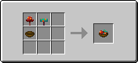  
**Nutrition**: 5.0  
**Saturation**: 6.0  

#### Fried Egg
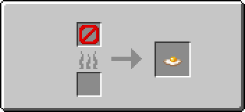  
**Nutrition**: 4.0  
**Saturation**: 4.8  

#### Cheese Slice
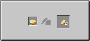  
*This craft is made by using a **[cutting board](workstations#cutting-board)!***  
**Nutrition**: 3.0  
**Saturation**: 2.2  

## Sweats

#### Pie Crust
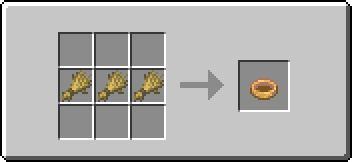  
*Pie Crust can be replaced by bread*  
**Nutrition**: 2.5  
**Saturation**: 6.0  

#### Apple Pie
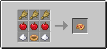  
**Nutrition**: 8.0  
**Saturation**: 6.0  

#### Apple Pie Slice
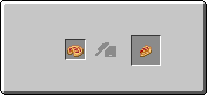  
*This craft is made by using a **[cutting board](workstations#cutting-board)!***  
**Nutrition**: 2.0  
**Saturation**: 1.5  

#### Glow Berry Pie
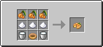  
**Nutrition**: 8.0  
**Saturation**: 6.0  
**Effect**: Glowing (3:00)  

#### Glow Berry Pie Slice
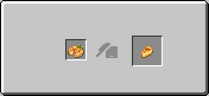  
*This craft is made by using a **[cutting board](workstations#cutting-board)!***  
**Nutrition**: 2.0  
**Saturation**: 1.5  
**Effect**: Glowing (0:45)  

#### Chocolate Pie
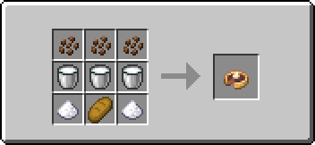  
**Nutrition**: 8.0  
**Saturation**: 6.0  
**Effect**: Speed I (3:00)  

#### Chocolate Pie Slice
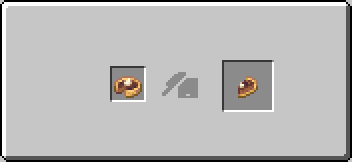  
*This craft is made by using a **[cutting board](workstations#cutting-board)!***  
**Nutrition**: 2.0  
**Saturation**: 1.5  
**Effect**: Speed I (0:45)  

#### Sweet Berry Cheesecake
  
**Nutrition**: 8.0  
**Saturation**: 6.0  
**Effect**: Speed I (3:00)  

#### Sweet Berry Cheesecake Slice
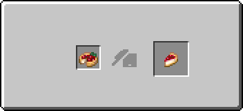  
*This craft is made by using a **[cutting board](workstations#cutting-board)!***  
**Nutrition**: 2.0  
**Saturation**: 1.5  
**Effect**: Speed I (0:45)  

#### Honey Cookie
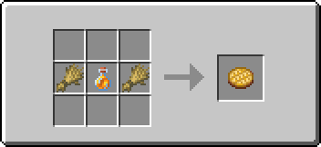  
**Nutrition**: 1.0  
**Saturation**: 0.5  

#### Sweet Berry Cookie
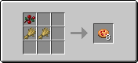  
**Nutrition**: 1.0  
**Saturation**: 0.5  

#### Melon Popsicle
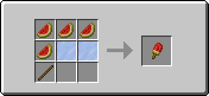  
**Nutrition**: 3  
**Saturation**: 1  

## Drinks

#### Apple Cider
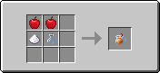  
**Effect**: Absorption I (1:30)  

#### Apple Cider Horn
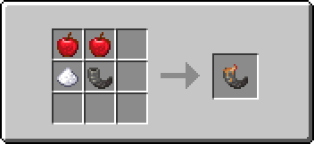  
**Effect**: Absorption I (1:30)  

#### Glow Berry Custard
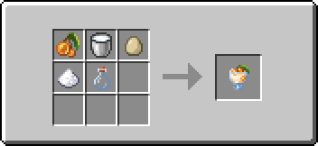  
**Effect**: Glowing (3:00)  

#### Glow Berry Custard Horn
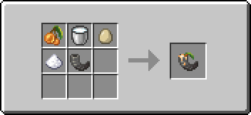  
**Effect**: Glowing (3:00)  

#### Hot Cocoa
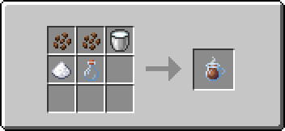  
**Effect**: Regeneration (0:30)  

#### Hot Cocoa Horn
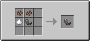  
**Effect**: Regeneration (0:30)  

#### Melon Juice
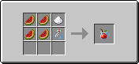  
**Effect**: Instant Health I  

#### Melon Juice Horn
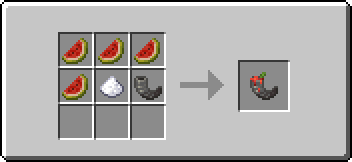  
**Effect**: Instant Health I  

## Tools

#### Flint Knife
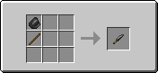  
**Attack Damage**: 4.5  
**Attack Speed**: 3  
**Durability**: 131  

#### Iron Knife
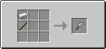  
**Attack Damage**: 4.5  
**Attack Speed**: 3  
**Durability**: 250  

#### Golden Knife
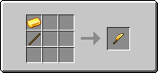  
**Attack Damage**: 3.0  
**Attack Speed**: 3  
**Durability**: 32  

#### Diamond Knife
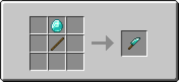  
**Attack Damage**: 5.0  
**Attack Speed**: 3  
**Durability**: 1561  

#### Netherite Knife
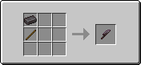  
**Attack Damage**: 5.5  
**Attack Speed**: 3  
**Durability**: 2032  

## Workstations

#### Cutting Board
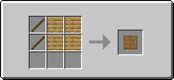  
Go [here](workstations#cutting-board) to see how work the **cutting board**!