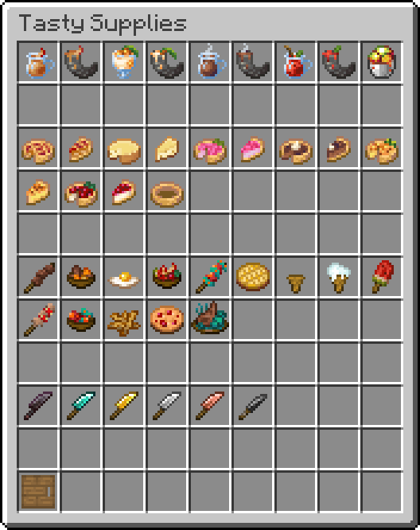

# Tasty Supplies

> A [Farmer's Delight](https://github.com/vectorwing/FarmersDelight) inspired Datapack.

## About The Datapack

**Tasty Supplies** is datapack that add a lot of new food, recipes and even cooking mechanics in Minecraft by remaining Vanilla. <br>
You'll be able to prepare a wide variety of delicious dishes from cookies to salad and pies.

If you want to keep track of what's new and to keep an eye on the progress of the project, you can star the project on [GitHub](https://github.com/atomic-junky/tasty-supplies).

All the items added by Tasty Supplies:<br>


## Installation and Requirements

Tasty Supplies is only compatible with Minecraft 1.20.5+.
You can find all the [releases](https://github.com/atomic-junky/tasty-supplies/releases) on GitHub.

### Data Pack

Download the data pack and put it in the `%appdata%/.minecraft/saves/<your_world>/datapacks` folder.
If you're already in game type `/reload` or leave and join the world.

### Ressource Pack

*The resource pack is required if you want to use Tasty Supplies.*

Download the ressource pack and put it in the `%appdata%/.minecraft/resourcepacks` folder.

#### Forced ressource pack on server

If you don't want to ask anyone on a server to download the ressource pack follow these steps:

1. Download the latest ressource pack
2. Go to [SHA1 File Checksum](https://emn178.github.io/online-tools/sha1_checksum.html) and upload the ressource pack.
3. Copy the SHA1 output (it'll be usefull later).
4. In your `server.properties` file add this:

```
resource-pack=https://github.com/atomic-junky/tasty-supplies/releases/download/<lastest_version>/Tasty_Supplies_-_Resource_Pack.zip
resource-pack-sha1=<SHA1>
```

`<SHA1>` is the code obtained earlier and `<latest_version>` is the latest version like: `v0.4.1`
